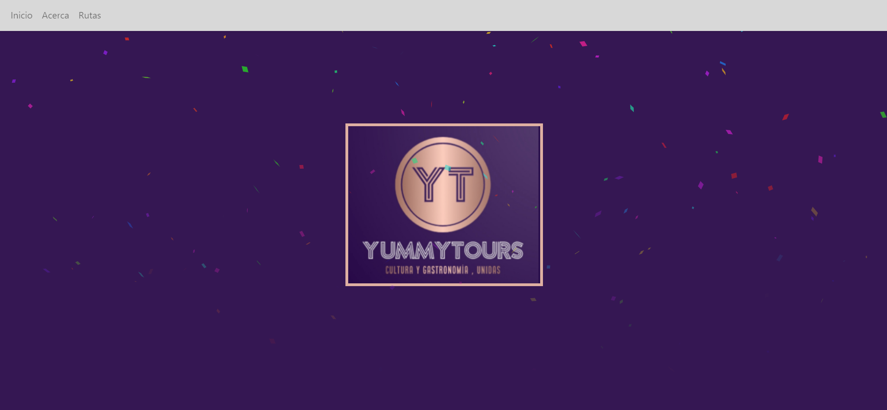
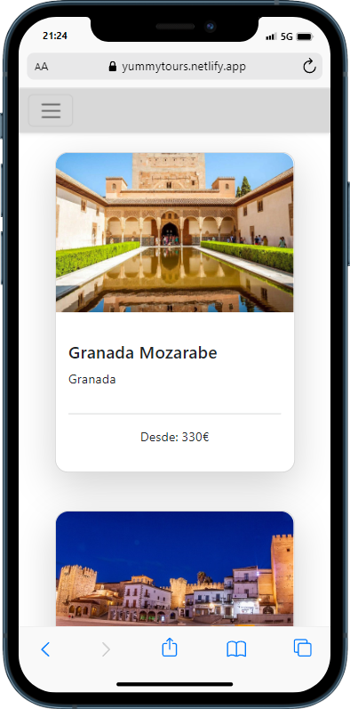
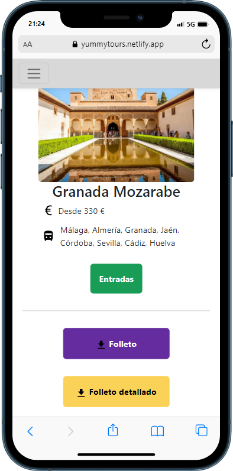

# Yummy Tours

App de reservas de rutas turísticas.
Se ha simulado la reserva. 
Esta web es ficticia, pero se estudia que en un futuro pueda darle uso, añadiendo trabajadores en una base de datos y las rutas que ellos llevan.

## Tabla de contenidos
- [Vista general](#vista-general)
  - [Enlace a la web](#enlace-a-la-web)
  - [Capturas en ordenador](#capturas-en-ordenador)
  - [Capturas en móvil](#capturas-en-móvil)
- [Desarrollo](#desarrollo)
  - [Tecnologías](#tecnologías)
  - [Reproducir en local](#reproducir-en-local)
- [Autor](#autor)
- [Recommended IDE Setup](#recommended-ide-setup)

## Vista General
### Enlace a la web
Descubre A baja temperatura en:
https://yummytours.netlify.app/

### Capturas en ordenador


### Capturas en móvil



## Desarrollo
### Tecnologías
- Maquetación: HTML5
- Estilos: Sass, Bootstrap
- Funcionalidad: Svelte + TypeScript
- Empaquetador: Vite
- Librerias: Svelte-toast

### Reproducir en local
Clona el proyecto
```
  git clone https://github.com/geminway92/yummytours
```
Entra en la carpeta
```
  cd yummytours
```
Instala las dependencias del proyecto
```
  npm install
```
Construye el proyecto
```
  npm run build
```
Inicia el proyecto en local
```
  npm run dev
```

## Autor
- [Gema Martín](https://github.com/geminway92)
## Recommended IDE Setup

[VS Code](https://code.visualstudio.com/) + [Svelte](https://marketplace.visualstudio.com/items?itemName=svelte.svelte-vscode).

